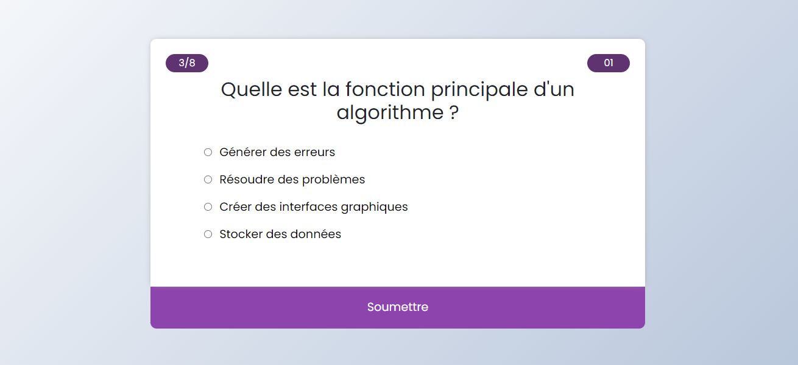

# Quiz App - Application Web de Quiz interactif

Le **Quiz App** est une application web interactive conçue pour tester et améliorer vos connaissances sur divers sujets. Le jeu propose un quiz composé de 8 questions, chacune ayant une seule réponse correcte. Le joueur dispose de 10 secondes pour répondre à chaque question. Si la réponse est correcte, elle sera mise en évidence en vert ; si elle est incorrecte, elle sera mise en évidence en rouge.

À la fin du quiz, le joueur recevra un score en pourcentage basé sur le nombre de réponses correctes. Les résultats sont interprétés comme suit :
- Score inférieur à 50% : Échec
- Score de 50% : Bien
- Score supérieur à 50% : Très bien

## Caractéristiques

- Quiz interactif avec 8 questions à réponse unique.
- Compte à rebours de 10 secondes par question pour ajouter du défi.
- Rétroaction visuelle en temps réel pour les réponses correctes et incorrectes.
- Évaluation finale du score avec interprétation.
- Inclusion d'une ambiance musicale pour une expérience immersive.

## Aperçu

## Utilisation

1. Clonez ce référentiel sur votre machine locale : `git clone https://github.com/mokaddemhicham/quiz-app.git`

2. Accédez au répertoire du projet : `cd quiz-app`

3. Ouvrez `index.html` dans votre navigateur préféré pour commencer à jouer.

## Dépendances

Aucune dépendance externe n'est requise. Toutefois, pour une expérience optimale, assurez-vous d'utiliser un navigateur web moderne.

## Contribuer

Les contributions sont les bienvenues ! Si vous avez des idées pour améliorer ce quiz sérieux, n'hésitez pas à créer une issue ou une demande d'extraction.

## Licence

Ce projet est sous licence MIT. Pour plus d'informations, consultez le fichier [LICENSE](LICENSE).
